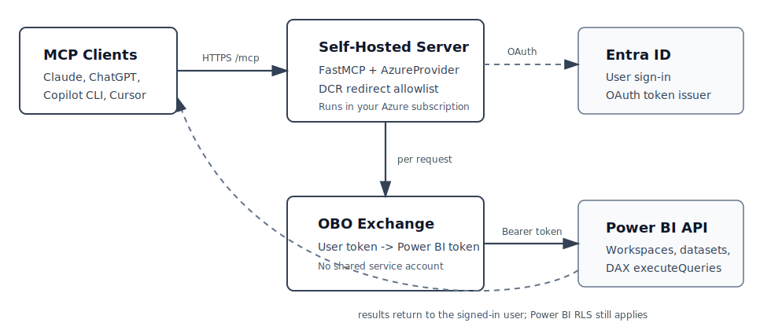

# powerbi-mcp-proxy

A self-hosted MCP (Model Context Protocol) server that proxies MCP clients such as **Claude** to **Power BI** — using your own Entra tenant, your own Azure subscription. A drop-in workaround for Microsoft's broken hosted endpoint.

[](LICENSE)
[](https://www.python.org/downloads/)
[](https://github.com/PrefectHQ/fastmcp)
[](https://github.com/AviHack/powerbi-mcp-proxy/actions/workflows/ci.yml)

---

This is a **reference implementation**, not a hosted service. This repository
does not deploy anything into the maintainer's Azure tenant. You deploy your
own copy into your own Azure subscription and Entra tenant.

## The problem

Microsoft's hosted Power BI MCP endpoint at `api.fabric.microsoft.com/v1/mcp/powerbi` has been broken since early 2026:

```
AADSTS9010010: The resource parameter provided in the request
               doesn't match with the requested scopes
```

The discovery response emits a `resourceUrl` field that conflicts with the requested scopes against Entra's v2 endpoint. OAuth attempts fail in affected MCP clients. See [microsoft/powerbi-modeling-mcp#68](https://github.com/microsoft/powerbi-modeling-mcp/issues/68) for the full thread.

## What this is

A self-hosted server (~275 lines) that:

- Runs its own OAuth proxy via FastMCP's `AzureProvider` — never emits the offending `resourceUrl` field.
- Each user signs in with their own Microsoft account.
- Per-request **On-Behalf-Of** token exchange — Power BI RLS applies per user, no shared service account.
- Single-tenant, enforced at startup (multi-tenant configs are rejected).
- Terraform spins up the whole thing on Azure App Service in one apply.

## What this is **not**

- **Not a managed service.** You bring your own Entra app registration and your own Azure hosting.
- **Not multi-tenant.** Each deployment serves one Entra tenant. (You can run several copies.)
- **Not a drop-in replacement for the Microsoft endpoint** in the "zero-setup" sense. It is a drop-in replacement in the "actually works" sense.

## Tools exposed

| Tool | Purpose |
|------|---------|
| `list_workspaces` | Workspaces the signed-in user can see |
| `list_datasets` | Datasets in a workspace |
| `run_dax_query` | Arbitrary `EVALUATE …` DAX against a dataset, as the user |
| `list_measures`, `list_columns` | Stubs — schema enumeration is unsupported on imported datasets; the stubs explain why and suggest `run_dax_query` probes |

Deliberately narrow. Build your own `@mcp.tool()` functions on top of `run_dax_query` for domain-specific reports.

## Architecture



```
MCP client (Claude / other MCP clients)
       │  HTTPS
       ▼
  This server  ── AzureProvider OAuth proxy ──▶ login.microsoftonline.com
       │
       └── Per-request OBO exchange (azure-identity)
              │
              ▼
       Power BI REST API
       (queries run with the user's RLS — no service account)
```

Full auth flow and component breakdown in [docs/architecture.md](docs/architecture.md).

## Known Working Clients

| Client | Redirect URI pattern | Status |
|--------|----------------------|--------|
| Claude.ai | `https://claude.ai/api/mcp/*` | Default pattern |
| ChatGPT | `https://chatgpt.com/connector_platform_oauth_redirect` | Needs independent verification |
| GitHub Copilot CLI | TBD | Needs verification |
| Cursor | TBD | Needs verification |

Verified additions are welcome. Use the MCP client redirect URI issue template
or open a PR that updates this table and `terraform.tfvars.example`.

## Quick start

### Prerequisites

- An **Azure subscription** with admin rights to create app registrations
- **Power BI tenant setting** "Dataset Execute Queries REST API" enabled
- **Terraform** `>= 1.5.0`
- **Azure CLI** for deployment
- **Python** `3.11+` (for local development only)

### 1. Configure and apply Terraform

```bash
cd infra
cp terraform.tfvars.example terraform.tfvars
# Edit terraform.tfvars: set subscription_id, tenant_id, owner
terraform init
terraform plan        # review every resource before applying
terraform apply
```

When apply succeeds, Terraform prints a `next_steps` output that walks you through the remaining manual steps.

### 2. Grant admin consent

Portal → Entra ID → App registrations → `<your-project>-server` → API permissions → **Grant admin consent**.

### 3. (Strongly recommended) Configure Conditional Access

Your Entra app's sign-in surface is now exposed to the public internet. Without Conditional Access (or at minimum MFA), one phished password gives an attacker OBO'd Power BI access to that user.

See [docs/azure-setup.md#conditional-access](docs/azure-setup.md#conditional-access) for the policy. Scope it to the new app registration — it won't affect anything else in your tenant.

### 4. Deploy

See [docs/deployment-azure-app-service.md](docs/deployment-azure-app-service.md)
for the full Azure App Service deployment guide. The short version:

```bash
python -m zipfile -c app.zip pbi_mcp_remote.py requirements.txt
az webapp deploy \
  --name <your-project-name> \
  --resource-group <your-project-name>-rg \
  --src-path app.zip \
  --type zip
```

If you want deploys from your own GitHub repo instead, see [docs/github-actions-deploy.md](docs/github-actions-deploy.md). This public repo does not deploy anything automatically.

### 5. Connect a client

Add the MCP endpoint to your client's custom connector configuration:

```
https://<your-project-name>.azurewebsites.net/mcp
```

(Replace `<your-project-name>` with whatever you set in `terraform.tfvars`.) First connection triggers a one-time OAuth consent prompt per user.

## Local development

```bash
python -m venv .venv
.venv\Scripts\activate                  # Windows
# source .venv/bin/activate              # macOS/Linux

pip install -r requirements.txt
cp .env.example .env                     # fill in ALL values — JWT_SIGNING_KEY is required
uvicorn pbi_mcp_remote:app --host 127.0.0.1 --port 8000
```

For testing against a real MCP client locally, expose `localhost:8000` via `ngrok http 8000` (or your tunnel of choice) and update `MCP_SERVER_URL` to the public URL. Remember to add the tunnel's callback to `MCP_ALLOWED_REDIRECT_URIS` if you're not using Claude.ai.

## Cost

The default Terraform path runs on **Azure App Service B1 Linux** (~$13/month). Key Vault is a few cents. Optional GitHub Actions OIDC has no direct cost.

To run cheaper: deploy the Docker image to a smaller host (Fly.io, Railway, a $5 VPS) — see the included [Dockerfile](Dockerfile). You lose the Key Vault wiring and have to manage secrets yourself; read [SECURITY.md](SECURITY.md) first.

## Documentation

| File | What's in it |
|------|--------------|
| [docs/architecture.md](docs/architecture.md) | Auth + data flow, components, network surface |
| [docs/azure-setup.md](docs/azure-setup.md) | Admin consent, Conditional Access, Power BI tenant settings |
| [docs/deployment-azure-app-service.md](docs/deployment-azure-app-service.md) | Recommended Azure App Service deployment path |
| [docs/github-actions-deploy.md](docs/github-actions-deploy.md) | Optional GitHub Actions deploy setup for your own repo |
| [docs/troubleshooting.md](docs/troubleshooting.md) | Common errors and what they actually mean |
| [SECURITY.md](SECURITY.md) | Threat model, enforced guards, recommended hardening |
| [CONTRIBUTING.md](CONTRIBUTING.md) | How to propose changes |
| [CHANGELOG.md](CHANGELOG.md) | Release notes |

## Contributing

PRs welcome — especially for **additional verified MCP client redirect URI patterns** (ChatGPT, Copilot CLI, Cursor, etc.). Verify in your own tenant first, then open a PR with the pattern and a note on how you tested it.

Out of scope: domain-specific report tools. Keep your business logic in your own fork. The goal here is a small, auditable surface that as many people as possible can deploy with confidence.

See [CONTRIBUTING.md](CONTRIBUTING.md) for details.

## Related

- [microsoft/powerbi-modeling-mcp#68](https://github.com/microsoft/powerbi-modeling-mcp/issues/68) — the upstream bug this works around
- [PrefectHQ/fastmcp](https://github.com/PrefectHQ/fastmcp) — the MCP framework
- [modelcontextprotocol.io](https://modelcontextprotocol.io) — protocol spec

## License

MIT — see [LICENSE](LICENSE).
